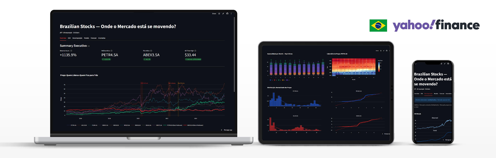
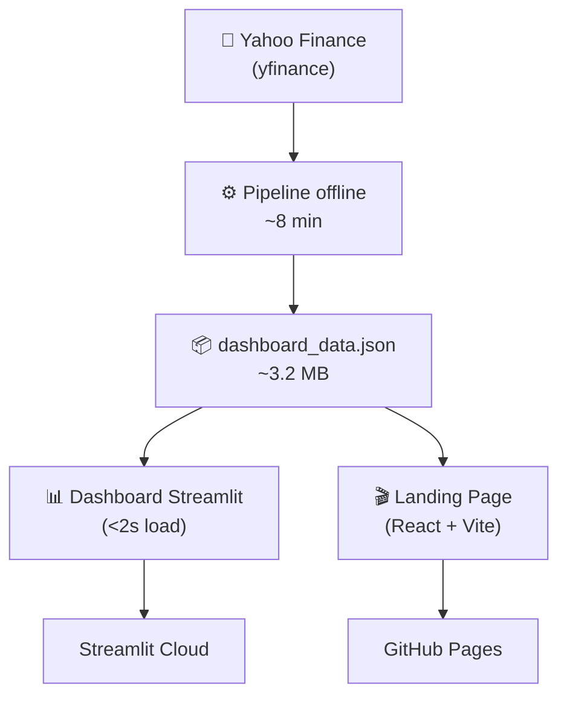

<p align="center">
  
</p>

<h1 align="center">BR Stocks — Análise de Séries Temporais</h1>

<p align="center">
  <b>Pipeline automatizado</b> de forecasting, anomalias e visualização<br />
  para o mercado de ações brasileiro.
</p>

<p align="center">
  <a href="https://br-stocks-ts-pipeline-sca7v3vvdzvpfc42zdkxkg.streamlit.app/">
    
  </a>
  <a href="https://cavalcanteprofissional.github.io/br-stocks-ts-pipeline/">
    
  </a>
  <a href="https://github.com/cavalcanteprofissional/br-stocks-ts-pipeline/blob/main/LICENSE">
    
  </a>
</p>

---

## Fluxo



---

## Sobre

Este projeto nasceu para **automatizar a análise de séries temporais** do mercado de ações brasileiro — sem depender de APIs caras, sem spinners no dashboard, sem esperar ARIMA rodar em tempo real.

| Etapa | Descrição |
|-------|-----------|
| **Pipeline offline** | Baixa dados do Yahoo Finance, processa, ajusta ARIMA/SARIMA, gera forecasts e detecta anomalias |
| **Serialização** | Tudo vira um JSON de ~3.2 MB — o dashboard só lê esse arquivo |
| **Dashboard instantâneo** | Abre em <2s — sem chamadas de API, sem spinner, sem ARIMA em runtime |
| **Landing page** | Scrollytelling com React + Vite para apresentar os insights de forma visual |

### Stack

| Camada | Tecnologia |
|--------|-----------|
| Pipeline | Python 3.14, pandas 3.0+, statsmodels, pmdarima |
| Dashboard | Streamlit 1.58+, Plotly |
| Landing Page | React 18, Vite, Chart.js, framer-motion |
| Dados | Yahoo Finance (`yfinance`) |
| Infra | Poetry, Streamlit Cloud, GitHub Pages |
| Testes | Playwright (E2E), pytest |

---

## Dados

### Origem

Os dados vêm da **Yahoo Finance** via biblioteca [`yfinance`](https://github.com/ranaroussi/yfinance). São baixados uma única vez pelo pipeline e armazenados em cache como CSV em `data/`.

### Tickers

9 ações representativas de diferentes setores do mercado brasileiro:

| Ticker | Empresa | Setor |
|--------|---------|-------|
| `PETR4.SA` | Petrobras | Óleo & Gás |
| `VALE3.SA` | Vale | Mineração |
| `ITUB4.SA` | Itaú Unibanco | Bancário |
| `BBDC4.SA` | Bradesco | Bancário |
| `ABEV3.SA` | Ambev | Bebidas |
| `WEGE3.SA` | WEG | Indústria |
| `BBAS3.SA` | Banco do Brasil | Bancário |
| `B3SA3.SA` | B3 | Financeiro (Bolsa) |
| `RENT3.SA` | Localiza | Locação de Veículos |

### Período e Frequência

| Propriedade | Valor |
|-------------|-------|
| Início | 2015-01-01 |
| Frequência original | Diária |
| Frequência de modelagem | Semanal (`resample` com `.last()`) |
| Dados disponíveis | ~10 anos → ~520 semanas |

### Pipeline de Transformação

| Etapa | Descrição |
|-------|-----------|
| **Ingestão** | CSV bruto por ticker em `data/` |
| **Preprocessamento** | Série semanal com `Close`, log-retornos, `returns`, `drawdown` |
| **EDA** | 11 gráficos Plotly (série, retornos, sazonalidade, correlação, volatilidade, ACF/PACF, heatmap mensal) |
| **Decomposição** | Tendência + Sazonalidade + Resíduo (additive/multiplicativo auto-detectado) |
| **ARIMA** | Ordem `(p,d,q)(P,D,Q,s)` otimizada por `auto_arima` |
| **Forecast** | Previsão com IC 95% (12 semanas) |
| **Outliers** | Anomalias batch (IQR sobre resíduos) + detecção em tempo real |
| **Diagnóstico** | Ljung-Box, Jarque-Bera, RMSE, MAE, MAPE, walk-forward CV |

---

## Começando

### Pré-requisitos

- Python >=3.11
- [Poetry](https://python-poetry.org/) — instale com `pipx install poetry`
- Node.js 18+

### Instalação

```bash
git clone https://github.com/cavalcanteprofissional/br-stocks-ts-pipeline.git
cd br-stocks-ts-pipeline

# Dependências Python
poetry install

# Dependências da Landing Page
cd landing && npm install && cd ..
```

### Pipeline (gerar JSON)

```bash
poetry run python scripts/generate_dashboard_data.py
```

> ~8 minutos. Resultado em `data/dashboard_data.json` (~3.2 MB).

### Dashboard Local

```bash
poetry run streamlit run src/dashboard.py
```

> Carrega em **<2s** — o JSON está pré-computado.

### Landing Page Local

```bash
cd landing
npm run dev
```

Acesse `http://localhost:5173/br-stocks-ts-pipeline/`

### Extrair dados para Landing Page

```bash
poetry run python scripts/extract_landing_data.py
cd landing && npm run build
```

Gera `landing/public/landing_data.json` (~97 KB).

---

## Estrutura

```
st/
├── data/                          # Cache CSV + dashboard_data.json
├── landing/                       # React + Vite landing page
│   ├── public/
│   │   └── landing_data.json      # Subset ~97 KB
│   └── src/
│       ├── assets/                # hero-bg.mp4, logo.png, thumbnail.png
│       ├── components/
│       │   ├── charts/            # RankingBar, DrawdownChart, CorrelationMatrix, ForecastChart
│       │   ├── AboutCard.jsx
│       │   ├── CTASection.jsx
│       │   ├── ForecastSection.jsx
│       │   ├── HeroSection.jsx
│       │   ├── MarketHealthSection.jsx
│       │   ├── Navbar.jsx
│       │   ├── RankingSection.jsx
│       │   └── ScrollReveal.jsx
│       ├── hooks/
│       │   └── useCountUp.js
│       ├── data/
│       │   └── loadData.js
│       └── styles/
│           └── globals.css
├── scripts/
│   ├── generate_dashboard_data.py # Pipeline completo
│   └── extract_landing_data.py    # Subset para landing
├── src/
│   ├── config.py                  # Configuração central
│   ├── ingest.py                  # Download yfinance + cache
│   ├── preprocess.py              # Resample, log-retornos, features
│   ├── eda.py                     # 11 gráficos Plotly
│   ├── decompose.py               # Decomposição sazonal
│   ├── outliers.py                # Detecção batch + real-time
│   ├── modeling.py                # ARIMA fitting, forecast, diagnóstico
│   └── dashboard.py               # App Streamlit
├── tests/
│   ├── test_dashboard_e2e.py      # Playwright E2E
│   └── ...
├── CHANGELOG.md
├── TODO.md
└── README.md
```

---

## Testes

```bash
# Unitários
poetry run pytest tests/ -v

# E2E (Playwright)
poetry run pytest tests/test_dashboard_e2e.py -v
```

> 7/8 testes E2E passam em ~12s. 1 xfail (limitação do Streamlit em troca de tab).

---

## Deploy

### Dashboard (Streamlit Cloud)

O deploy é automático via GitHub. O segredo: `data/dashboard_data.json` está commitado (exceção no `.gitignore`), então o Cloud carrega o JSON instantaneamente. Caso o JSON não exista, o pipeline roda como fallback (~8 min).

### Landing Page (GitHub Pages)

```bash
cd landing
npm run build
npm run deploy
```

> ⚠️ O `.gitignore` raiz tem `data/` — por isso o JSON da landing fica em `public/landing_data.json`, não em `public/data/`.

---

## Roadmap

- [x] Pipeline offline → JSON
- [x] Dashboard instantâneo
- [x] Landing page scrollytelling
- [x] Navbar + Footer
- [x] About Me Card
- [x] Vídeo background na Hero Section
- [ ] Modo escuro/claro
- [ ] Comparação entre modelos (ARIMA vs Prophet vs LSTM)
- [ ] Suporte a mais frequências (diária, mensal)

---

## Autor

<p align="center">
  <b>Lucas Cavalcante dos Santos</b><br />
  dev dados com py, lm, streamlit, folium, pytorch, opencv<br />
  <a href="https://github.com/cavalcanteprofissional">GitHub</a> ·
  <a href="https://cavalcanteprofissional.github.io/portfolio/">Portfólio</a> ·
  <a href="https://linkedin.com/in/cavalcante-Lucas">LinkedIn</a>
</p>

---

## Licença

MIT
