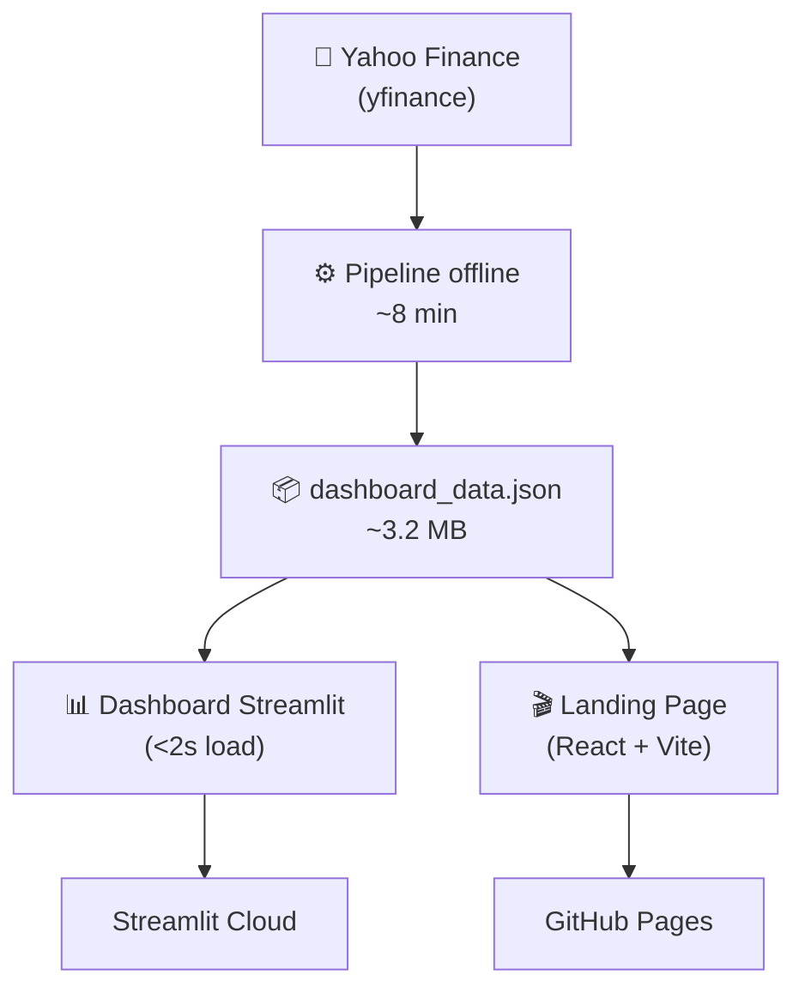

# BR Stocks — Análise de Séries Temporais

**Pipeline automatizado** de análise de séries temporais para ações brasileiras: forecasting com ARIMA/SARIMA, detecção de anomalias, dashboard interativo e landing page scrollytelling.



---

## 🌐 Links

| O quê | URL |
|-------|-----|
| **Dashboard Streamlit** | [Clique aqui](https://br-stocks-ts-pipeline-sca7v3vvdzvpfc42zdkxkg.streamlit.app/) |
| **Landing Page** | [Clique aqui](https://cavalcanteprofissional.github.io/br-stocks-ts-pipeline/) |

---

## 📖 Sobre o Projeto

Este projeto nasceu para **automatizar a análise de séries temporais** do mercado de ações brasileiro — sem depender de APIs caras, sem spinners no dashboard, sem esperar ARIMA rodar em tempo real.

O fluxo é simples:

1. **Pipeline offline** baixa os dados do Yahoo Finance, processa, ajusta modelos ARIMA/SARIMA, gera forecasts e detecta anomalias
2. **Tudo vira um JSON** de ~3.2 MB — o dashboard só lê esse arquivo
3. **Dashboard abre em <2s** — sem chamadas de API, sem spinner, sem ARIMA em runtime
4. **Landing page** scrollytelling com React + Vite para apresentar os insights de forma visual

### Stack

| Camada | Tecnologia |
|--------|-----------|
| Pipeline | Python 3.14, pandas 3.0+, statsmodels, pmdarima |
| Dashboard | Streamlit 1.58+, Plotly |
| Landing Page | React 18, Vite, Chart.js, framer-motion |
| Dados | Yahoo Finance (`yfinance`) |
| Infra | Poetry, Streamlit Cloud, GitHub Pages |
| Testes | Playwright (E2E), pytest |

---

## 📊 Dados

### Origem

Os dados vêm da **Yahoo Finance** via biblioteca [`yfinance`](https://github.com/ranaroussi/yfinance). São baixados uma única vez pelo pipeline e armazenados em cache como CSV em `data/`.

### Tickers Analisados

9 ações representativas de diferentes setores do mercado brasileiro:

| Ticker | Empresa | Setor |
|--------|---------|-------|
| `PETR4.SA` | Petrobras | Óleo & Gás |
| `VALE3.SA` | Vale | Mineração |
| `ITUB4.SA` | Itaú Unibanco | Bancário |
| `BBDC4.SA` | Bradesco | Bancário |
| `ABEV3.SA` | Ambev | Bebidas |
| `WEGE3.SA` | WEG | Indústria |
| `BBAS3.SA` | Banco do Brasil | Bancário |
| `B3SA3.SA` | B3 | Financeiro (Bolsa) |
| `RENT3.SA` | Localiza | Locação de Veículos |

### Período

- **Início:** 2015-01-01
- **Frequência original:** Diária
- **Frequência de modelagem:** Semanal (resample com `.last()`)
- **Dados disponíveis:** ~10 anos → ~520 semanas

### O que é gerado a partir dos dados brutos

| Etapa | O que produz |
|-------|-------------|
| Ingestão | CSV bruto por ticker em `data/` |
| Preprocessamento | Série semanal com `Close`, log-retornos, `returns`, `drawdown` |
| EDA | 11 gráficos Plotly (série, retornos, sazonalidade, correlação, volatilidade, ACF/PACF, heatmap mensal) |
| Decomposição | Tendência + Sazonalidade + Resíduo (additive/multiplicativo auto-detectado) |
| ARIMA | Ordem `(p,d,q)(P,D,Q,s)` otimizada por `auto_arima` |
| Forecast | Previsão com intervalo de confiança de 95% (12 semanas) |
| Outliers | Anomalias batch (IQR sobre resíduos) + detecção em tempo real |
| Diagnóstico | Ljung-Box, Jarque-Bera, RMSE, MAE, MAPE, walk-forward CV |

---

## 🚀 Começando

### Pré-requisitos

- Python >=3.11
- [Poetry](https://python-poetry.org/) (instale com `pipx install poetry`)
- Node.js 18+ (para a landing page)

### Instalação

```bash
# Clonar
git clone https://github.com/cavalcanteprofissional/br-stocks-ts-pipeline.git
cd br-stocks-ts-pipeline

# Dependências Python
poetry install

# Dependências da Landing Page
cd landing && npm install && cd ..
```

### Executar o Pipeline (gera o JSON)

```bash
poetry run python scripts/generate_dashboard_data.py
```

⏱ ~8 minutos. O resultado estará em `data/dashboard_data.json` (~3.2 MB).

### Dashboard Local

```bash
poetry run streamlit run src/dashboard.py
```

Carrega em **menos de 2 segundos** — o JSON já está pré-computado.

### Landing Page Local

```bash
cd landing
npm run dev
```

Acesse `http://localhost:5173/br-stocks-ts-pipeline/`

### Extrair dados para Landing Page

```bash
poetry run python scripts/extract_landing_data.py
cd landing && npm run build
```

Gera `landing/public/landing_data.json` (~97 KB) — um subset leve para a landing.

---

## 🏗️ Estrutura do Projeto

```
st/
├── data/                          # Cache CSV + dashboard_data.json
├── landing/                       # React + Vite landing page
│   ├── public/
│   │   ├── landing_data.json      # Subset ~97KB para a landing
│   │   └── data/
│   │       └── landing_data.json  # (fallback)
│   └── src/
│       ├── assets/                # hero-bg.mp4, logo.png
│       ├── components/            # Hero, Ranking, MarketHealth, Forecast, CTA,
│       │   ├── charts/            #   AboutCard, Navbar, ScrollReveal
│       │   └── charts/            # RankingBar, DrawdownChart, CorrelationMatrix,
│       │                          #   ForecastChart
│       ├── hooks/                 # useCountUp
│       ├── data/                  # loadData.js
│       └── styles/                # globals.css
├── scripts/
│   ├── generate_dashboard_data.py # Pipeline completo
│   └── extract_landing_data.py    # Extrai subset para landing
├── src/
│   ├── config.py                  # Configuração central
│   ├── ingest.py                  # Download yfinance + cache
│   ├── preprocess.py              # Resample, log-retornos, features
│   ├── eda.py                     # 11 gráficos Plotly
│   ├── decompose.py               # Decomposição sazonal
│   ├── outliers.py                # Detecção batch + real-time
│   ├── modeling.py                # ARIMA fitting, forecast, diagnóstico
│   └── dashboard.py               # App Streamlit
├── tests/
│   ├── test_dashboard_e2e.py      # Playwright E2E (7/8 passam)
│   └── ...
├── CHANGELOG.md
├── TODO.md
└── README.md
```

---

## 🧪 Testes

```bash
# Testes unitários
poetry run pytest tests/ -v

# E2E (Playwright)
poetry run pytest tests/test_dashboard_e2e.py -v
```

7/8 testes E2E passam em ~12s. 1 xfail (limitação do Streamlit em troca de tab).

---

## 🚢 Deploy

### Dashboard (Streamlit Cloud)

O deploy é automático via GitHub. O segredo: `data/dashboard_data.json` está commitado (exceção no `.gitignore`), então o Cloud carrega o JSON instantaneamente.

Caso o JSON não exista (deploy limpo), o dashboard executa o pipeline automaticamente como fallback (~8 min).

### Landing Page (GitHub Pages)

```bash
cd landing
npm run build
npm run deploy   # publica na branch gh-pages
```

> ⚠️ O `.gitignore` raiz tem `data/` — por isso o JSON da landing fica em `public/landing_data.json`, não em `public/data/`.

---

## 🗺️ Roadmap

- [x] Pipeline offline → JSON
- [x] Dashboard instantâneo
- [x] Landing page scrollytelling
- [x] Navbar + Footer
- [x] About Me Card
- [x] Vídeo background na Hero
- [ ] Modo escuro/claro
- [ ] Comparação entre modelos (ARIMA vs Prophet vs LSTM)
- [ ] Suporte a mais frequências (diária, mensal)

---

## 👤 Autor

**Lucas Cavalcante dos Santos**  
dev dados com py, lm, streamlit, folium, pytorch, opencv  
[GitHub](https://github.com/cavalcanteprofissional) · [Portfólio](https://cavalcanteprofissional.github.io/portfolio/) · [LinkedIn](https://linkedin.com/in/cavalcante-Lucas)

---

## 📄 Licença

MIT
