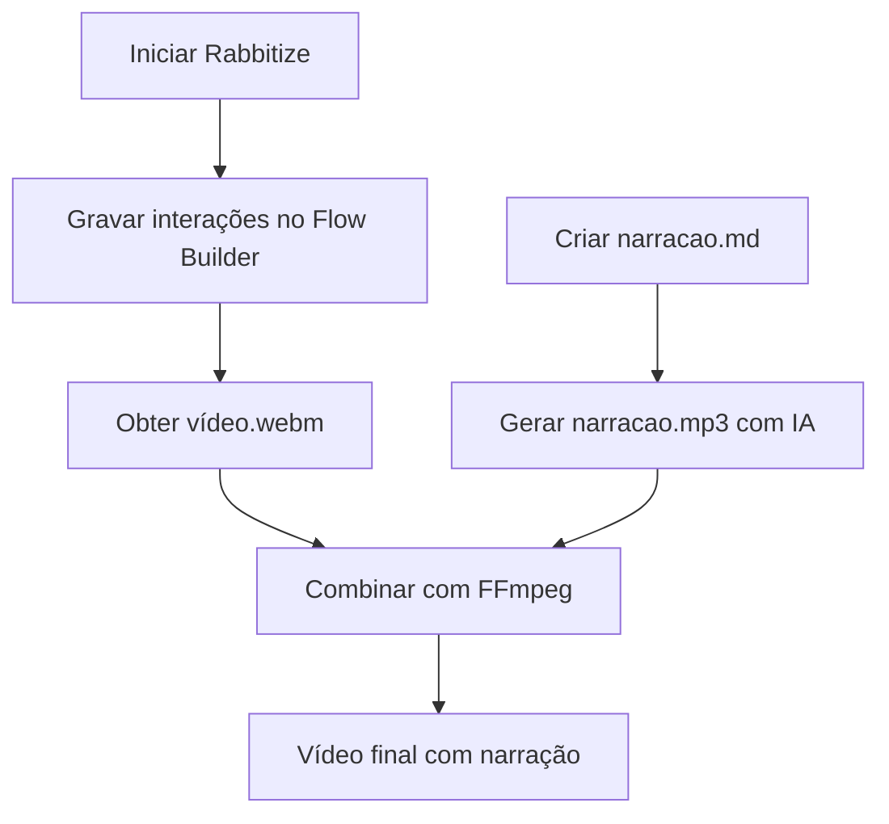

# 📹 Guia Completo: Criando Vídeo de Demonstração com Rabbitize

Este guia ensina como utilizar o **Rabbitize** para criar um vídeo de demonstração da sua aplicação, capturando interações com a landing page e o Streamlit, além de integrar narração em áudio gerada por IA.

---

## 📌 Pré-requisitos

- Node.js (versão 16 ou superior)
- NPM ou Yarn
- Navegador Chromium (instalado automaticamente)
- Aplicação Streamlit em execução (`streamlit run app.py`)

---

## 🚀 Passo 1: Instalação do Rabbitize

```bash
# Instalar o Rabbitize globalmente
npm install -g rabbitize

# Instalar dependências do Playwright
sudo npx playwright install-deps

# Instalar navegador Chromium
npx playwright install chromium

# Iniciar o servidor Rabbitize
npx rabbitize
```

Após a instalação, o servidor estará disponível em: `http://localhost:3037`

---

## 🎬 Passo 2: Criando a Gravação

### Método A: Usando o Flow Builder (Recomendado)

1. Acesse `http://localhost:3037/flow-builder` no navegador
2. Digite a URL da sua landing page no campo e clique em **Start**
   - Exemplo: `https://meusistema.com` ou `http://localhost:3000`
3. Execute sua demonstração:
   - Navegue até a página do Streamlit (ex: clicando em "Abrir App")
   - Clique nos botões, preencha formulários, execute as ações desejadas
   - Cada clique e interação é registrado automaticamente
4. Quando terminar, clique em **Stop Session**

O vídeo é salvo automaticamente em:

```
rabbitize-runs/[session-id]/video.webm
```

### Método B: Usando CLI (Para automação)

Crie um arquivo `comandos.json` com as ações:

```json
[
  [":move-mouse", ":to", 100, 200],
  [":click", ":at", 100, 200],
  [":type", "texto de exemplo"],
  [":wait", 3],
  [":move-mouse", ":to", 300, 400],
  [":click", ":at", 300, 400]
]
```

Execute o comando:

```bash
rabbitize --stability-detection false \
          --exit-on-end true \
          --process-video true \
          --client-id "demo-streamlit" \
          --port 3000 \
          --batch-url "https://sua-landing-page.com" \
          --batch-commands='[
            [":move-mouse", ":to", 100, 200],
            [":click", ":at", 100, 200],
            [":wait", 2],
            [":move-mouse", ":to", 300, 400],
            [":click", ":at", 300, 400]
          ]'
```

---

## 🗂️ Passo 3: Organizando o Conteúdo da Narração

Crie um arquivo `narracao.md` com o roteiro para a narração em áudio:

```markdown
# 🎙️ Roteiro de Narração - Demonstração do Sistema

## Cena 1: Página Inicial (0:00 - 0:05)
Bem-vindo ao nosso sistema de gerenciamento inteligente. Nesta demonstração, vamos mostrar como você pode utilizar nossas ferramentas de forma simples e eficiente.

## Cena 2: Acessando o Streamlit (0:05 - 0:15)
Agora vamos acessar nossa aplicação principal, desenvolvida com Streamlit. Clique no botão "Abrir Aplicação" para continuar.

## Cena 3: Interação com o Sistema (0:15 - 0:30)
Na tela principal, você encontra todas as funcionalidades. Vamos inserir alguns dados no formulário e clicar em "Processar" para ver o sistema em ação.

## Cena 4: Resultado (0:30 - 0:40)
Veja como os dados são processados e apresentados em tempo real. O sistema é rápido e intuitivo.

## Cena 5: Encerramento (0:40 - 0:50)
Esta foi uma demonstração rápida das funcionalidades principais. Para mais informações, consulte nossa documentação completa.
```

---

## 🔊 Passo 4: Gerando Áudio com IA

### Opção A: Usando Google Text-to-Speech (gTTS) — Python

Crie um script `gerar_audio.py`:

```python
from gtts import gTTS
import os

# Ler o roteiro
with open('narracao.md', 'r', encoding='utf-8') as file:
    lines = file.readlines()

# Extrair apenas as linhas de narração (sem os cabeçalhos)
texto_narracao = []
for line in lines:
    if line.startswith('##') or line.startswith('#'):
        continue
    if line.strip():
        texto_narracao.append(line.strip())

texto_completo = ' '.join(texto_narracao)

# Gerar áudio em português
tts = gTTS(text=texto_completo, lang='pt', slow=False)
tts.save('narracao.mp3')
print("✅ Áudio gerado com sucesso!")
```

Execute:

```bash
pip install gtts
python gerar_audio.py
```

### Opção B: Usando ElevenLabs API (Maior qualidade)

```bash
# Instalar CLI
npm install -g elevenlabs-cli

# Gerar áudio
echo "Seu texto de narração aqui..." | elevenlabs-cli \
  --api-key "sua_chave_aqui" \
  --voice-id "21m00Tcm4TlvDq8ikWAM" \
  --output narracao.mp3
```

### Opção C: Usando Edge TTS (Gratuito, qualidade boa)

```bash
# Instalar
pip install edge-tts

# Gerar áudio
edge-tts --text "Seu texto de narração aqui..." --write-media narracao.mp3 --voice pt-BR-AntonioNeural
```

---

## 🎞️ Passo 5: Combinando Vídeo e Áudio

Use o **FFmpeg** para unir o vídeo e o áudio:

```bash
# Instalar FFmpeg (se não tiver)
# Ubuntu/Debian: sudo apt install ffmpeg
# macOS:         brew install ffmpeg
# Windows:       baixar de ffmpeg.org

# Combinar vídeo do Rabbitize com áudio gerado
ffmpeg -i rabbitize-runs/demo-streamlit/video.webm \
       -i narracao.mp3 \
       -c:v libx264 \
       -c:a aac \
       -map 0:v:0 \
       -map 1:a:0 \
       -shortest \
       -movflags +faststart \
       apresentacao_final.mp4
```

> ✅ Vídeo final: `apresentacao_final.mp4`

### Ajuste fino do áudio (opcional)

Se o áudio estiver mais longo que o vídeo:

```bash
# Ajustar velocidade do áudio para caber no vídeo
ffmpeg -i narracao.mp3 -filter:a "atempo=1.2" narracao_ajustada.mp3

# Combinar novamente
ffmpeg -i rabbitize-runs/demo-streamlit/video.webm \
       -i narracao_ajustada.mp3 \
       -c:v libx264 -c:a aac -map 0:v:0 -map 1:a:0 -shortest \
       apresentacao_final.mp4
```

---

## 📋 Resumo do Fluxo Completo



---

## 🛠️ Comando Único para tudo (Linux/macOS)

Crie um script `demo.sh`:

```bash
#!/bin/bash

# Iniciar Rabbitize
npx rabbitize &
sleep 5

# Iniciar Streamlit
streamlit run app.py &
sleep 5

# Abrir landing page no navegador
open http://localhost:3037/flow-builder

echo "✅ Serviços iniciados!"
echo "📹 Grave sua demonstração no Flow Builder"
echo "⚡ Quando terminar, pressione ENTER para continuar"
read

# Gerar áudio
edge-tts --text "Bem-vindo à demonstração do nosso sistema..." --write-media narracao.mp3 --voice pt-BR-AntonioNeural

# Combinar vídeo e áudio
ffmpeg -i rabbitize-runs/latest/video.webm -i narracao.mp3 \
       -c:v libx264 -c:a aac -map 0:v:0 -map 1:a:0 -shortest \
       apresentacao_final.mp4

echo "🎬 Vídeo gerado: apresentacao_final.mp4"
```

---

## 📝 Dicas Finais

- **Streamlit:** Deixe sua aplicação rodando em `http://localhost:8501` durante a gravação
- **Landing Page:** Certifique-se de que o link para o Streamlit esteja funcionando
- **Qualidade do vídeo:** O Rabbitize captura em alta resolução; use `viewport: "1080p"` no roteiro

**Legendagem automática** com Whisper (OpenAI):

```bash
pip install openai-whisper
whisper narracao.mp3 --model small --language Portuguese --output_format srt
```

**Compactar** o vídeo final:

```bash
ffmpeg -i apresentacao_final.mp4 -vf scale=1280:720 -c:v libx264 -crf 23 apresentacao_compactada.mp4
```

---

## 🔗 Links Úteis

- [Rabbitize GitHub](https://github.com/rabbitize/rabbitize)
- [Playwright Screencast API](https://playwright.dev/docs/videos)
- [ElevenLabs](https://elevenlabs.io)
- [Edge TTS](https://github.com/rany2/edge-tts)

---

> Pronto! Agora você tem um vídeo completo com narração da sua aplicação, pronto para apresentar ao seu time ou clientes! 🎉
